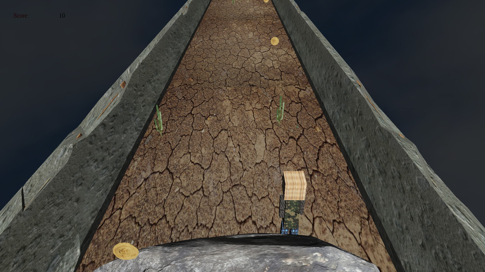
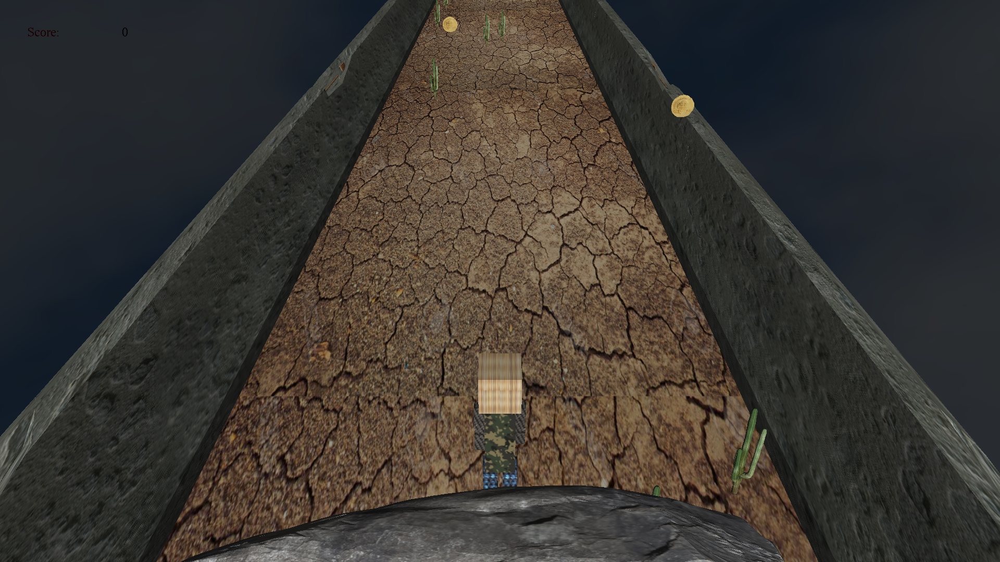

# Run, Melos
A temple run-like game with a different style. Implemented in OpenGL.
<table>
  <tr>
    <td>
      
    </td>
    <td>
      
    </td
  </tr>
  <tr>
    <td>
      
    </td>
    <td>
      
    </td>
  </tr>
</table>

## Dependencies
1. OpenGl
2. Glut
3. Glue
4. Glaux
5. irrKlang

## Setup
simply using Visual Studio 2017 open the `MinerRun.sln` file in order to run the game in the debugging mode.

The game has been developed using VS2017, but you can manage with other version of visual studio after managing any dependency conflicts.
### Note
make sure that your dependencies are setup correctly before running the project. All dependency dll files are included in the repo.
